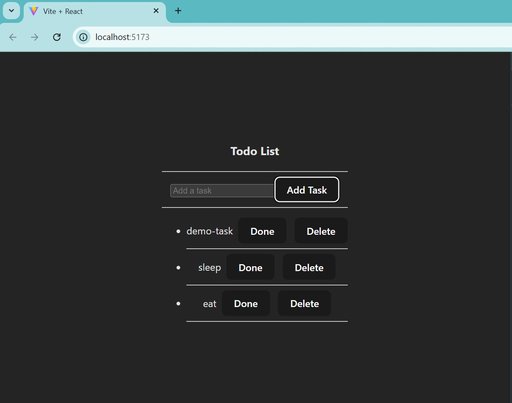

#  Redux Toolkit Todo App

This is a simple Todo List application built using **React** and **Redux Toolkit**.  
It helps manage state globally when your application becomes too complex for just using React state.
It is built with my begineer understanding

---

## 🚀 Features

- Add, delete, and mark todos as done 
- Uses Redux Toolkit
- Uses `nanoid` to generate unique IDs for tasks
- Auto-generates actions
- Built with my beginner understanding of Redux concepts

---

## Redux Q&A – Beginner Notes
These are my own answers that helped me understand Redux Toolkit better while making this todo app 👇
---
Action is something that is happened
Reducers are the things that happen when a certain action takes place
---
1.What is Redux?

Redux is a state management library which is used when your application becomes too complex and has a lot of states in it.
Let’s say your application has a states for different components and you want to share the info between the states, so normal React won’t allow it.
You can use Redux where all states are stored in one file which can be accessed by different components.
---
2.What is Redux Toolkit and why use it?

Now when we build applications that are complex and have a lot of states in it, it is advisable to use Redux Toolkit with Redux to simplify the process.
Redux Toolkit gives you the power of mutability using Immer and also auto-generates actions for you.
---
3.What is a slice in Redux Toolkit?

Slice is a bundle of actions and reducers related or used by a single component.
It contains state, initialState, and reducers with state and action.
---
4.How does Redux Toolkit handle immutability?

See the thing is, when writing normal React code, React does not allow us to change the state directly.
Each time we have to create a new copy and make changes to it.
But using Redux, we can mutate it directly because Redux Toolkit handles that part — like it creates a copy and makes changes to it.
---
5.What does createSlice do?

createSlice creates a slice which has your state name, initialState, and reducers related to your single component.
This can be used in any file and they can access the store.
---
6.What is the Redux Store and how do you set it up?

Store is a thing where you store and manage all the states.
We create it using configureStore from Redux Toolkit and add reducer from the slice file to it.
---
7.What are actions and how are they handled?

Actions is nothing but what happened — like add task is an action, delete task is an action.
We can write actions manually but Redux Toolkit auto-generates them for the reducers.
---
8.What does nanoid() do in this app?

Actually, it's like uuid. It generates ID for key and I used it because using it becomes easy to access a particular element in a list,
and in React, it wants you to add a key for an element.

---
##  Screenshot

> *Note: This project focuses on understanding and implementing Redux Toolkit, not on the UI or design part. The styling is kept simple to focus on functionality.*
---
This app and this README were written as part of my learning process.
All answers above are from my understanding as a beginner in Redux Toolkit and I wanted to explain them in my own way.
